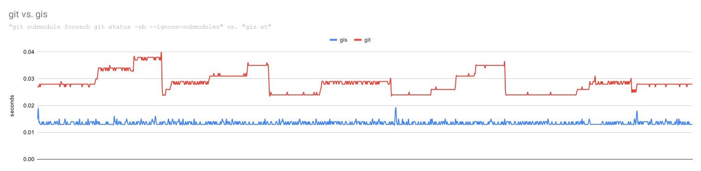

[](https://github.com/nqminhuit/gis/actions/workflows/maven.yml)

# Introduction
- Features: extension for `git` to manage multiple [repositories](https://github.com/nqminhuit/gis/issues/14) or git submodules.
- Blazing-fast command line application written in `Java` and built on top of latest technologies:
    - `native image` from GraalVM to compile into machine code and run without JVM or JDK.
    - Java 21's Virtual Threads: lightweight threads that reduce the effort of writing, maintaining, and debugging high-throughput concurrent applications.
- Easy to use:
    - The app is completely bundled into a standalone executable file, no extra dependencies needed.
    - Add `.gis-modules` file if you need to manage multiple repos (not git submodules)
    - Run `gis -h` or `gis <commands> -h` for help

# Build from source

## Native image
(require docker/podman to build)

There are 2 GraalVM distributions: [GraalVM CE](https://www.graalvm.org/22.0/docs/getting-started/) and [Mandrel](https://developers.redhat.com/blog/2021/04/14/mandrel-a-specialized-distribution-of-graalvm-for-quarkus). Since this app is written in Java completely, Mandrel is prefered.

```shell script
cd gis
podman build -t gis . || return 1; podman create --name dkgis_ gis:latest; podman cp dkgis_:/app/gis/gis .; podman rm -f dkgis_
```
After the steps above, an executable file named `gis` will be created under project directory.

## JVM

```shell script
cd gis
mvn clean verify package
```
The executable jar file will be created at `target/gis-<version>.jar`

## Debug

```
java -agentlib:jdwp=transport=dt_socket,address=9999,server=y,suspend=n -jar path/to/gis-<version>.jar
```

# Usage

For more details, just run:
```shell script
./gis --help
```

Generate completion for zsh:
```
./gis completion --directory ${fpath[1]}
```
Reload your zsh session, we can now press `<TAB>` for autocomplete.

Currently gis only support zsh for completion.

# Config

Gis will read config from file at `~/.config/gis.config`

Supported configs:
```
| key                     | description                                             | default value       |
|-------------------------+---------------------------------------------------------+---------------------|
| default_branches        | comma separated values indicate default branch values   | master,main,develop |
| feature_branch_prefixes | comma separated values indicate feature branch prefixes | feature/            |
```

Note: do NOT insert space into value part.

Don't:
```
master, main, develop
```

Do:
```
master,main,develop
```

example:
```
default_branches=master,main,develop
feature_branch_prefixes=feature/
```

The reason that value parsing is not that smart is because that we use default Java core package `java.util.Properties` to parse values. We prefer Java's core over extra dependencies.


# Comparison

notes:
- `git submodule` commands do not take the root module into account, however `gis` does.
- the data was generated on the same repository, same machine.

## status



command for generating the above numbers:
```shell script
for i in {1..1000}; do { time git submodule foreach git status -sb --ignore-submodules; } 2>> git_st_report done
# took 28s638ms in total

for i in {1..1000}; do { time gis st; } 2>> gis_st_report done
# took 13s654ms in total
```

## fetch


command for generating the above numbers:
```shell script
for i in {1..100}; do { time git submodule foreach git fetch; } 2>> git_fe_report done
# took 29m43s442ms

for i in {1..100}; do { time gis fe; } 2>> gis_fe_report done
# took 5m11s832ms
```

# Code quality

Use Sonarqube to analyze code:
```shell script
podman run -d --name sonarqube -e SONAR_ES_BOOTSTRAP_CHECKS_DISABLE=true -p 9876:9000 docker.io/sonarqube:9.9.5-community
```

Then go to `http://localhost:9876`
- login (admin/admin), then change your password
- go to `http://localhost:9876/projects` and click "Add a project"
- choose "Manually"
- input "Project key" and "Display name" e.g., "gis" then click "Set Up"
- "Generate a token": enter a name for this token then click "Generate"
- you will get something like this: 302481a5dee289283af983ac713174e2f2ed13da. Click "Continue"
- as shown in the 2nd step, with maven:
    ```shell script
    mvn sonar:sonar -Dsonar.projectKey=gis -Dsonar.host.url=http://localhost:9876 -Dsonar.login=302481a5dee289283af983ac713174e2f2ed13da
    ```
- after the maven command above succcess, you will have a dashboard about `gis` project

# Performance

Performed automatically at: https://github.com/nqminhuit/gis-stress-test when: 

1. any changes to gis **master** branch: will perform stress test on **small** dataset
2. when gis publishes a new **release**: will perform stress test on both **small** and **large** dataset
