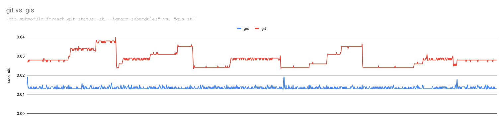
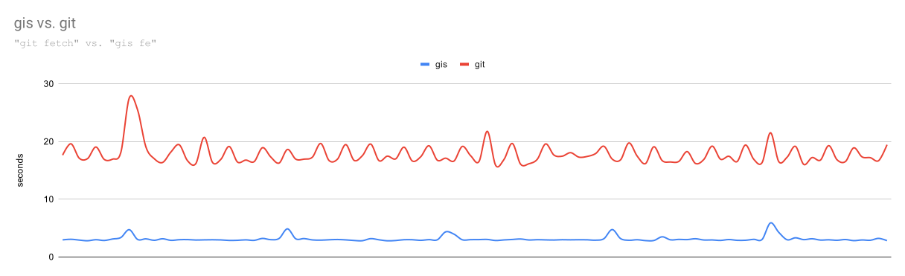

[](https://github.com/nqminhuit/gis/actions/workflows/ci.yml)

# Introduction
- Features: extension for `git` to manage multiple [repositories](https://github.com/nqminhuit/gis/issues/14) or git submodules.
- Blazing-fast command line application written in `Java` and built on top of latest technologies:
    - `native image` from GraalVM to compile into machine code and run without JVM or JDK.
    - Java 21's Virtual Threads: lightweight threads that reduce the effort of writing, maintaining, and debugging high-throughput concurrent applications.
- Easy to use:
    - The app is completely bundled into a standalone executable file, no extra dependencies needed.
    - Add `.gis-modules` file if you need to manage multiple repos (not git submodules)
    - Run `gis -h` or `gis <commands> -h` for help

# Build from source

## Native image
(require docker/podman to build)

There are 2 GraalVM distributions: [GraalVM CE](https://www.graalvm.org/22.0/docs/getting-started/) and [Mandrel](https://developers.redhat.com/blog/2021/04/14/mandrel-a-specialized-distribution-of-graalvm-for-quarkus). Since this app is written in Java completely, Mandrel is prefered.

### Checking out repository and build
```shell script
cd gis
podman build -t gis . || return 1; podman create --name dkgis_ gis:latest; podman cp dkgis_:/app/gis/gis .; podman rm -f dkgis_
```
After the steps above, an executable file named `gis` will be created under project directory.

### Build without checking out repository
```bash
podman build -t gis https://github.com/nqminhuit/gis.git
podman create --name gis_ gis:latest
podman cp gis_:/app/gis/gis .
podman rm -f gis_
```

## Run integration tests inside a container

`Testcontainers` can run from inside a container by following the official "docker wormhole" pattern: mount the project directory at the same path inside the test container and also mount a Docker-compatible socket. This repository wraps that setup in Make targets so contributors can reuse the same containerized workflow locally and in CI-like environments.

### Docker
```bash
make test-in-container-docker
```

### Podman (rootless)
```bash
systemctl --user enable --now podman.socket
make test-in-container-podman
```

### Custom runtime or Maven arguments
```bash
make test-in-container CONTAINER_RUNTIME=podman MAVEN_ARGS="-Dtest=GisIntTest verify"
```

Notes:
- The Make target mounts the source tree at the current working directory, mounts the container socket at `/var/run/docker.sock`, and runs `mvn clean verify` inside a Maven 21 container.
- For Docker Desktop, export `TESTCONTAINERS_HOST_OVERRIDE=host.docker.internal` before running the Make target.
- For rootless Podman, the Make target disables `Ryuk`, which matches Testcontainers' Podman guidance.

## JVM

```shell script
cd gis
mvn clean verify package
```
The executable jar file will be created at `target/gis-<version>.jar`

## Debug

```
java -agentlib:jdwp=transport=dt_socket,address=9999,server=y,suspend=n -jar path/to/gis-<version>.jar
```

# Usage

For more details, just run:
```shell script
./gis --help
```

Generate completion for zsh:
```
./gis completion --directory ${fpath[1]}
```
Reload your zsh session, we can now press `<TAB>` for autocomplete.

Currently gis only support zsh for completion.


Run `gis fe -q` to start `git fetch` for the root repository and every configured module in the background, then exit immediately without waiting for fetch results.

## Structured output

`gis status` prints a colored report meant for human eyes. To consume it from another client, ask
for JSON instead:

```shell script
gis status --format=json
```

The document holds every module (the root repository first, then the submodules, honoring
`--sort`), the branch header of `git status -sb` and the changed files of
`git status --porcelain=v1`:

```json
{
  "fetchedAt": "2024-05-06T07:08:09",
  "modules": [
    {
      "module": "gis",
      "root": true,
      "branch": {
        "name": "master",
        "upstream": "origin/master",
        "ahead": 2,
        "behind": 9,
        "gone": false,
        "detached": false
      },
      "files": [
        {
          "indexStatus": " ",
          "worktreeStatus": "M",
          "path": "pom.xml",
          "originalPath": null
        },
        {
          "indexStatus": "R",
          "worktreeStatus": " ",
          "path": "text-0001",
          "originalPath": "text-1"
        }
      ]
    }
  ]
}
```

Notes:
- `fetchedAt` is the last modification time of `.git/FETCH_HEAD` of the root repository in
  ISO-8601, or `null` when the repository was never fetched.
- `branch` is `null` when git reported no branch line for that module, `name` is `"HEAD"` when
  `detached` is true, and `upstream` is `null` when the branch tracks nothing.
- `indexStatus` and `worktreeStatus` are the two status columns of `git status --porcelain=v1`
  ("?" for untracked, " " for unmodified).
- `originalPath` is only filled for renames and copies, where `path` holds the destination.
- paths are decoded, so the escaping git applies through `core.quotePath` is undone and `path`
  can be used as is.
- `--format=text` is the default; `--one-line` has no effect on the JSON output.
- do not combine `--format=json` with `-v` or `--dry-run`: both write to stdout as well, which
  would break the document for the client parsing it.
- a module whose git command failed or timed out is left out of `modules`, and `gis` exits with
  a non zero code while the reason is reported on stderr.

For example, to list the modules which are behind their upstream:
```shell script
gis status --format=json | jq -r '.modules[] | select(.branch.behind > 0) | .module'
```

## Progress of each module

Every command runs its modules concurrently, so with `--progress` `gis` reports how far each of
them got. The report goes to **stderr**, one JSON document per line, which leaves stdout to the
result of the command:

```shell script
gis fetch --progress
```

```json
{"gis":{"status":"pending"},"module1":{"status":"pending"},"module2":{"status":"pending"}}
{"gis":{"status":"in-progress"},"module1":{"status":"pending"},"module2":{"status":"in-progress"}}
{"gis":{"status":"in-progress"},"module1":{"status":"in-progress"},"module2":{"status":"done"}}
{"gis":{"status":"done"},"module1":{"status":"failed"},"module2":{"status":"done"}}
```

Every line holds every module, so a client can render the latest line it read and does not have
to accumulate state. A module is:
- `pending` until its command starts,
- `in-progress` while the command runs,
- `done` when the command succeeded,
- `failed` when git exited with a non zero code, when the module could not be run at all, or
  when it was aborted because the run timed out (see `module_timeout_seconds`).

Once a run gives up on the modules which did not finish, their state is final: a module aborted
mid flight stays `failed` even if its command was about to succeed.

Note that `gis fetch -q` only starts the fetches and exits, so there `done` means that the fetch
was started, not that it completed.

stderr also carries the human readable warnings and errors, and those are not JSON. A client
should therefore only read the lines starting with `{`:
```shell script
gis status --format=json --progress 2> >(grep --line-buffered '^{' > progress.jsonl) > status.json
```

`--progress` works for every command, and combines with `--format=json`.

# Config

Gis will read config from file at `~/.config/gis.config`

Supported configs:
```
| key                     | description                                             | default value       |
|-------------------------+---------------------------------------------------------+---------------------|
| default_branches        | comma separated values indicate default branch values   | master,main,develop |
| feature_branch_prefixes | comma separated values indicate feature branch prefixes | feature/            |
| dont_care_files         | comma separated root-level files shown in faint gray    |                     |
| module_timeout_seconds  | seconds to wait for a module before aborting it         | 60                  |
| max_concurrency         | max modules processed in parallel at a time             | 5                   |
```

Note: do NOT insert space into value part.

Don't:
```
master, main, develop
```

Do:
```
master,main,develop
```

example:
```
default_branches=master,main,develop
feature_branch_prefixes=feature/
dont_care_files=.editorconfig,.gitmodules,launch.json,pom.xml
max_concurrency=5
```

Note: `max_concurrency` limits how many modules run git commands at the same time. A high value can cause the remote to reset SSH connections when fetching/pulling many modules at once (e.g. `kex_exchange_identification: read: Connection reset by peer`), since too many concurrent SSH handshakes from the same source can hit the remote's connection limits.

The reason that value parsing is not that smart is because that we use default Java core package `java.util.Properties` to parse values. We prefer Java's core over extra dependencies.


# Comparison

notes:
- `git submodule` commands do not take the root module into account, however `gis` does.
- the data was generated on the same repository, same machine.

## status



command for generating the above numbers:
```shell script
for i in {1..1000}; do { time git submodule foreach git status -sb --ignore-submodules; } 2>> git_st_report done
# took 28s638ms in total

for i in {1..1000}; do { time gis st; } 2>> gis_st_report done
# took 13s654ms in total
```

## fetch



command for generating the above numbers:
```shell script
for i in {1..100}; do { time git submodule foreach git fetch; } 2>> git_fe_report done
# took 29m43s442ms

for i in {1..100}; do { time gis fe; } 2>> gis_fe_report done
# took 5m11s832ms
```

# Code quality

Use Sonarqube to analyze code:
```shell script
podman run -d --name sonarqube -e SONAR_ES_BOOTSTRAP_CHECKS_DISABLE=true -p 9876:9000 docker.io/sonarqube:9.9.5-community
```

Then go to `http://localhost:9876`
- login (admin/admin), then change your password
- go to `http://localhost:9876/projects` and click "Add a project"
- choose "Manually"
- input "Project key" and "Display name" e.g., "gis" then click "Set Up"
- "Generate a token": enter a name for this token then click "Generate"
- you will get something like this: 302481a5dee289283af983ac713174e2f2ed13da. Click "Continue"
- as shown in the 2nd step, with maven:
    ```shell script
    mvn sonar:sonar -Dsonar.projectKey=gis -Dsonar.host.url=http://localhost:9876 -Dsonar.login=302481a5dee289283af983ac713174e2f2ed13da
    ```
- after the maven command above succcess, you will have a dashboard about `gis` project

# Performance

Performed automatically at: https://github.com/nqminhuit/gis-stress-test when: 

1. any changes to gis **master** branch: will perform stress test on **small** dataset
2. when gis publishes a new **release**: will perform stress test on both **small** and **large** dataset
