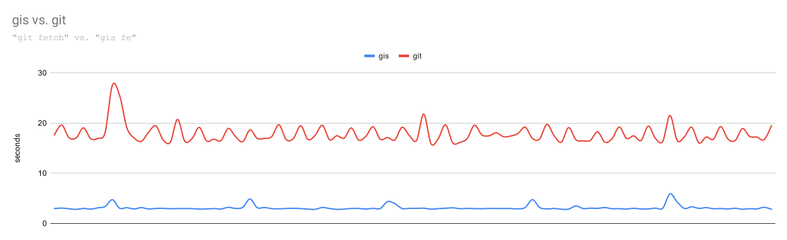

# Introduction
- Features: extension for `git` to manage multiple [repositories](https://github.com/nqminhuit/gis/issues/14) or git submodules.
- Blazing-fast command line application written in `Java` and built on top of latest technologies:
    - `native image` from GraalVM to compile into machine code and run without JVM or JDK.
    - [Eclipse Vert.x](https://vertx.io/) for asynchronuos execution. (*)
- Easy to use:
    - The app is completely bundled into a standalone executable file, no extra dependencies needed.
    - Add `.gis-modules` file if you need to manage multiple repos (not git submodules)
    - Run `gis -h` or `gis <commands> -h` for help

(*): the configs of Vertx were minimized to use as least resource as possible.

# Build from source

## Native image
(require docker to build)

There are 2 GraalVM distributions: [GraalVM CE](https://www.graalvm.org/22.0/docs/getting-started/) and [Mandrel](https://developers.redhat.com/blog/2021/04/14/mandrel-a-specialized-distribution-of-graalvm-for-quarkus). Since this app is written in Java completely, Mandrel is prefered.

```shell script
cd gis
docker build -t gis .
docker create --name dkgis_ gis:latest; docker cp dkgis_:/app/gis/gis .; docker rm -f dkgis_;
```
After the steps above, an executable file named `gis` will be created under project directory.

## JVM

```shell script
cd gis
mvn clean package
```
The executable jar file will be created at `target/gis-<version>.jar`

# Usage

For more details, just run:
```shell script
./gis
```

# Comparison

notes:
- `git submodule` commands do not take the root module into account, however `gis` does.
- the data was generated on the same repository, same machine.

## status


command for generating the above numbers:
```shell script
for i in {1..1000}; do { time git submodule foreach git status -sb --ignore-submodules; } 2>> git_st_report done
# took 28s638ms in total

for i in {1..1000}; do { time giss st; } 2>> gis_st_report done
# took 13s654ms in total
```

## fetch



command for generating the above numbers:
```shell script
for i in {1..100}; do { time git submodule foreach git fetch; } 2>> git_fe_report done
# took 29m43s442ms

for i in {1..100}; do { time giss fe; } 2>> gis_fe_report done
# took 5m11s832ms
```
